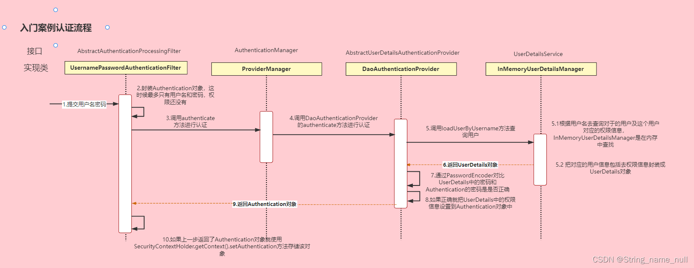

⏰正在建设中...
## 前后端通信发送json格式
### 添加书籍到购物车
```json
{
    "bookId":6,
    "quantity":9
}
```
### 下单
```json
{
  "address":"d35",
  "receiver":"hj",
  "items": [
    {
      "bookId": 1,
      "quantity": 2
    },
    {
      "bookId": 2,
      "quantity": 1
    }
  ]
}
```
### 登录
```json
{
    "email":"www",
    "password":"0"
}
```
